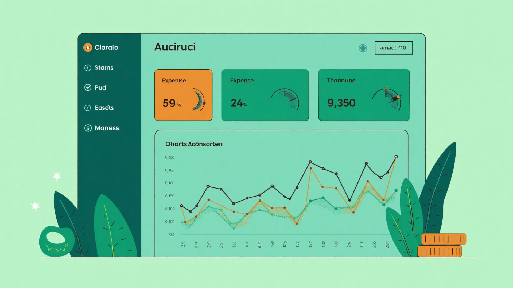

# Smart Daily Expense Tracker

A modern, AI-powered expense tracking application built with React, TypeScript, and Tailwind CSS. Features glassmorphism UI, comprehensive charts, AI expense parsing, and complete expense management.



## ✨ Features

### Core Functionality
- **📊 Dashboard** - Real-time expense tracking with interactive charts
- **💰 Manual Entry** - Add expenses with detailed forms
- **🤖 AI-Powered Entry** - Parse natural language expense descriptions
- **📜 History** - Searchable, filterable expense history with pagination
- **📈 Reports** - Weekly and monthly analytics with export options
- **👤 Profile** - User management and budget settings
- **⚙️ Settings** - Customizable preferences and notifications

### Design Features
- **🎨 Modern UI** - Glassmorphism effects with smooth animations
- **🌓 Dark/Light Mode** - Full theme support
- **📱 Fully Responsive** - Works on desktop, tablet, and mobile
- **♿ Accessible** - ARIA labels and semantic HTML
- **⚡ Fast** - Optimized performance with React

## 🚀 Quick Start

### Prerequisites
- Node.js 16+ and npm installed ([Install with nvm](https://github.com/nvm-sh/nvm))

### Installation

```bash
# Clone the repository
git clone <YOUR_GIT_URL>
cd smart-expense-tracker

# Install dependencies
npm install

# Start development server
npm run dev
```

The app will open at `http://localhost:8080`

### Demo Credentials
```
Email: demo@expensetracker.com
Password: demo123
```

## 📁 Project Structure

```
smart-expense-tracker/
├── src/
│   ├── assets/              # Images and static assets
│   ├── components/          # Reusable UI components
│   │   ├── ui/             # Shadcn UI components
│   │   ├── Navbar.tsx
│   │   ├── Sidebar.tsx
│   │   ├── Footer.tsx
│   │   ├── ThemeToggle.tsx
│   │   └── ...
│   ├── pages/              # Page components
│   │   ├── Login.tsx
│   │   ├── Register.tsx
│   │   ├── Dashboard.tsx
│   │   ├── AddExpense.tsx
│   │   ├── AIAdd.tsx
│   │   ├── History.tsx
│   │   ├── Reports.tsx
│   │   ├── Profile.tsx
│   │   └── Settings.tsx
│   ├── context/            # React Context providers
│   │   ├── AuthContext.tsx
│   │   └── ExpenseContext.tsx
│   ├── types/              # TypeScript type definitions
│   ├── constants/          # App constants (categories, etc.)
│   ├── utils/              # Utility functions
│   │   ├── formatters.ts   # Currency, date formatting
│   │   └── mockData.ts     # Sample data
│   ├── index.css           # Global styles & design system
│   └── App.tsx             # Main app component
├── public/                 # Static files
├── README.md              # This file
└── package.json           # Dependencies
```

## 🎨 Design System

The app uses a comprehensive design system defined in `src/index.css` and `tailwind.config.ts`:

### Colors
- **Primary**: Teal gradient (`hsl(185, 84%, 45%)`) - Trust & freshness
- **Accent**: Orange (`hsl(25, 95%, 58%)`) - Call-to-action
- **Success**: Green (`hsl(142, 76%, 36%)`) - Positive feedback
- **Glassmorphism**: Backdrop blur with transparency

### Components
All components use semantic design tokens:
- `gradient-primary` - Main brand gradient
- `gradient-accent` - Action buttons
- `glass-card` - Glassmorphism cards
- Smooth animations with CSS keyframes

## 🔧 Available Scripts

```bash
# Development
npm run dev          # Start dev server at http://localhost:8080

# Build
npm run build        # Build for production

# Preview
npm run preview      # Preview production build

# Lint
npm run lint         # Run ESLint
```

## 🌐 Deployment

### Deploy to Vercel (Recommended)

1. **Push to GitHub**
   ```bash
   git add .
   git commit -m "Initial commit"
   git push origin main
   ```

2. **Import to Vercel**
   - Go to [vercel.com](https://vercel.com)
   - Click "New Project"
   - Import your GitHub repository
   - Vercel auto-detects Vite settings
   - Click "Deploy"

3. **Your Live URL**
   ```
   https://expense-tracker-<your-name>.vercel.app
   ```

### Deploy to Netlify

1. **Build the project**
   ```bash
   npm run build
   ```

2. **Deploy via Netlify CLI**
   ```bash
   npm install -g netlify-cli
   netlify deploy --prod
   ```

   Or drag the `dist` folder to [app.netlify.com/drop](https://app.netlify.com/drop)

3. **Your Live URL**
   ```
   https://expense-tracker-<random-id>.netlify.app
   ```

### Environment Variables

For production deployment, create a `.env` file:

```env
# API Endpoints (when backend is ready)
VITE_API_URL=https://your-api.com
VITE_AI_PARSE_ENDPOINT=https://your-api.com/ai-parse
```

## 🔌 Backend Integration (TODO)

The app currently uses mock data. To integrate a real backend:

1. **Update API calls** in:
   - `src/context/AuthContext.tsx` - Authentication
   - `src/context/ExpenseContext.tsx` - Expense CRUD
   - `src/pages/AIAdd.tsx` - AI parsing endpoint

2. **Example API structure needed**:
   ```
   POST /api/auth/login
   POST /api/auth/register
   GET  /api/expenses
   POST /api/expenses
   PUT  /api/expenses/:id
   DELETE /api/expenses/:id
   POST /api/ai-parse
   ```

## 🧪 Testing

Unit tests can be added using Jest + React Testing Library:

```bash
npm install --save-dev @testing-library/react @testing-library/jest-dom jest
```

Example test for a component:
```typescript
import { render, screen } from '@testing-library/react';
import { PageHeader } from '@/components/PageHeader';

test('renders page header', () => {
  render(<PageHeader title="Test" subtitle="Subtitle" />);
  expect(screen.getByText('Test')).toBeInTheDocument();
});
```

## 📦 Technologies Used

- **React 18** - UI library
- **TypeScript** - Type safety
- **Vite** - Build tool
- **Tailwind CSS** - Styling
- **Shadcn UI** - Component library
- **Recharts** - Charts and visualizations
- **React Router** - Navigation
- **React Hook Form** - Form management
- **Sonner** - Toast notifications
- **date-fns** - Date utilities
- **Lucide React** - Icons

## 🎯 Future Enhancements

- [ ] Real backend API integration
- [ ] Actual AI expense parsing with OpenAI/GPT
- [ ] Multi-currency support
- [ ] Receipt photo upload & OCR
- [ ] Recurring expenses
- [ ] Budget categories
- [ ] Export to PDF (charts included)
- [ ] Mobile app (React Native)
- [ ] Multi-user support
- [ ] Bank account integration

## 📄 License

MIT License - feel free to use this project for learning or production.

## 🤝 Contributing

Contributions are welcome! Please:
1. Fork the repository
2. Create a feature branch
3. Commit your changes
4. Push to the branch
5. Open a Pull Request

## 💬 Support

For issues or questions:
- Open an issue on GitHub
- Email: support@expensetracker.com

---